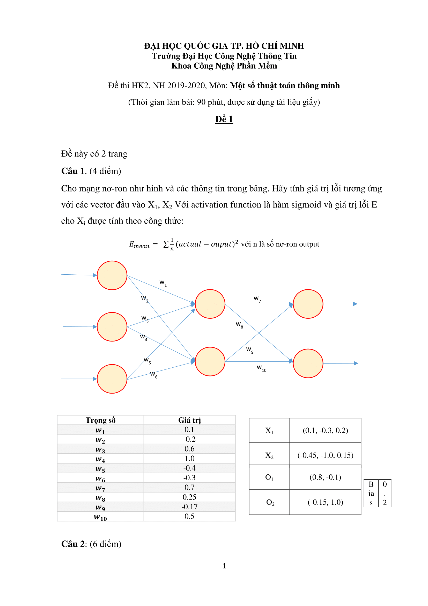

# PHƯƠNG ÁN 2: HƯỚNG DẪN GIẢI BÀI TẬP TỪNG BƯỚC (CẬP NHẬT MỚI)
# BÀI TẬP MẠNG NƠ-RON NHÂN TẠO (ANN)

---

## 📚 MỤC LỤC

1. [Tóm tắt công thức cần nhớ](#1-tóm-tắt-công-thức-cần-nhớ)
2. [BÀI TẬP 1: Giải đề Bài tập-3.png](#2-bài-tập-1-giải-đề-bài-tập-3png)
3. [BÀI TẬP 2: Giải đề thi SE313 (HK2 19-20)](#3-bài-tập-2-giải-đề-thi-se313-hk2-19-20)
4. [Bài tập tự luyện](#4-bài-tập-tự-luyện)

---

# 1. TÓM TẮT CÔNG THỨC CẦN NHỚ

## 1.1. Sigmoid
Hàm kích hoạt phổ biến nhất trong các bài tập này.

$$ \sigma(z) = \frac{1}{1 + e^{-z}} $$

**Bảng giá trị nhanh:**
| z | -1.0 | -0.5 | 0 | 0.5 | 1.0 |
|---|---|---|---|---|---|
| σ(z) | 0.269 | 0.378 | 0.500 | 0.622 | 0.731 |

## 1.2. Forward Propagation (Lan truyền tiến)
Tại mỗi node:
1. **Tính tổng trọng số (Weighted Sum):** $z = \sum (w_i \cdot x_i) + bias$
2. **Tính đầu ra (Activation):** $output = \sigma(z)$

## 1.3. Công thức tính lỗi (Error)
Có 2 công thức phổ biến (cần đọc kỹ đề):

**Dạng 1: Sum of Squared Errors (SSE) - Thường chia 2**
$$ E = \frac{1}{2} \sum (Target - Output)^2 $$

**Dạng 2: Mean Squared Error (MSE) - Chia cho n**
$$ E_{mean} = \frac{1}{n} \sum (Target - Output)^2 $$

---

# 2. BÀI TẬP 1: GIẢI ĐỀ BÀI TẬP-3.png

## 2.1. Phân tích đề bài

**1. Cấu trúc mạng:**
- **Input (3 node):** $x_1, x_2, x_3$
- **Hidden (2 node):** $h_1, h_2$
- **Output (2 node):** $o_1, o_2$
- **Bias:** $w_0 = 0.1$ (Áp dụng cho cả Hidden và Output layer)

**2. Trọng số (Weights):**
- **Lớp Input -> Hidden:**
  - Vào $h_1$: $w_1=0.1, w_3=0.7, w_5=-0.4$
  - Vào $h_2$: $w_2=0.2, w_4=1.0, w_6=-0.3$
- **Lớp Hidden -> Output:**
  - Vào $o_1$: $w_7=0.7, w_9=-0.17$
  - Vào $o_2$: $w_8=0.2, w_{10}=0.41$

**3. Công thức lỗi Output:**
$E = \frac{1}{2} \sum (t_d - o_d)^2$

---

## 2.2. Lời giải chi tiết: Trường hợp X1

**Input X1:** $(0.1, -0.3, 0.3)$
**Target (Đầu ra mong muốn):** $(1, 0.5)$

### BƯỚC 1: Tính toán tại Lớp Ẩn (Hidden Layer)

**Node $h_1$:**
- Tổng trọng số $z_{h1}$:
  $$ z_{h1} = (x_1 \cdot w_1) + (x_2 \cdot w_3) + (x_3 \cdot w_5) + bias $$
  $$ z_{h1} = (0.1 \cdot 0.1) + (-0.3 \cdot 0.7) + (0.3 \cdot -0.4) + 0.1 $$
  $$ z_{h1} = 0.01 - 0.21 - 0.12 + 0.1 = -0.22 $$

- Đầu ra $out_{h1}$:
  $$ out_{h1} = \sigma(-0.22) = \frac{1}{1 + e^{0.22}} \approx 0.445 $$

**Node $h_2$:**
- Tổng trọng số $z_{h2}$:
  $$ z_{h2} = (x_1 \cdot w_2) + (x_2 \cdot w_4) + (x_3 \cdot w_6) + bias $$
  $$ z_{h2} = (0.1 \cdot 0.2) + (-0.3 \cdot 1.0) + (0.3 \cdot -0.3) + 0.1 $$
  $$ z_{h2} = 0.02 - 0.3 - 0.09 + 0.1 = -0.27 $$

- Đầu ra $out_{h2}$:
  $$ out_{h2} = \sigma(-0.27) = \frac{1}{1 + e^{0.27}} \approx 0.433 $$

### BƯỚC 2: Tính toán tại Lớp Đầu Ra (Output Layer)

**Node $o_1$:**
- Tổng trọng số $z_{o1}$:
  $$ z_{o1} = (out_{h1} \cdot w_7) + (out_{h2} \cdot w_9) + bias $$
  $$ z_{o1} = (0.445 \cdot 0.7) + (0.433 \cdot -0.17) + 0.1 $$
  $$ z_{o1} = 0.3115 - 0.0736 + 0.1 = 0.3379 $$

- Đầu ra thực tế $out_{o1}$:
  $$ out_{o1} = \sigma(0.3379) \approx 0.584 $$

**Node $o_2$:**
- Tổng trọng số $z_{o2}$:
  $$ z_{o2} = (out_{h1} \cdot w_8) + (out_{h2} \cdot w_{10}) + bias $$
  $$ z_{o2} = (0.445 \cdot 0.2) + (0.433 \cdot 0.41) + 0.1 $$
  $$ z_{o2} = 0.089 + 0.1775 + 0.1 = 0.3665 $$

- Đầu ra thực tế $out_{o2}$:
  $$ out_{o2} = \sigma(0.3665) \approx 0.591 $$

### BƯỚC 3: Tính Giá trị Lỗi (Error)

$$ E = \frac{1}{2} [ (Target_1 - Output_1)^2 + (Target_2 - Output_2)^2 ] $$
$$ E = \frac{1}{2} [ (1 - 0.584)^2 + (0.5 - 0.591)^2 ] $$
$$ E = \frac{1}{2} [ (0.416)^2 + (-0.091)^2 ] $$
$$ E = \frac{1}{2} [ 0.173 + 0.008 ] $$
$$ E = 0.0905 $$

**✅ Kết quả cho X1: E ≈ 0.0905**

---

## 2.3. Lời giải chi tiết: Trường hợp X2

**Input X2:** $(-0.35, -1.5, 0.25)$
**Target:** $(-0.5, 0.5)$

**Bạn hãy tự luyện tập tính toán theo các bước trên. Dưới đây là đáp án để đối chiếu:**

1. **Lớp Ẩn:**
   - $z_{h1} = -0.035 - 1.05 - 0.1 + 0.1 = -1.085 \rightarrow out_{h1} \approx 0.252$
   - $z_{h2} = -0.07 - 1.5 - 0.075 + 0.1 = -1.545 \rightarrow out_{h2} \approx 0.176$

2. **Lớp Đầu Ra:**
   - $z_{o1} = (0.252 \cdot 0.7) + (0.176 \cdot -0.17) + 0.1 = 0.246 \rightarrow out_{o1} \approx 0.561$
   - $z_{o2} = (0.252 \cdot 0.2) + (0.176 \cdot 0.41) + 0.1 = 0.222 \rightarrow out_{o2} \approx 0.555$

3. **Lỗi E:**
   - $E = 0.5 \cdot [(-0.5 - 0.561)^2 + (0.5 - 0.555)^2]$
   - $E = 0.5 \cdot [(-1.061)^2 + (-0.055)^2] \approx 0.564$

**✅ Kết quả cho X2: E ≈ 0.564**

---

# 3. BÀI TẬP 2: GIẢI ĐỀ THI SE313 (HK2 19-20)

## 3.1. Phân tích sự khác biệt
So với bài tập 1, bài này có cấu trúc tương tự (3 Input - 2 Hidden - 2 Output) nhưng có **2 điểm khác biệt quan trọng** cần lưu ý:
1. **Bias = 0.2** (thay vì 0.1).
2. **Công thức tính lỗi khác:**
   $$ E_{mean} = \sum \frac{1}{n} (actual - output)^2 $$
   Với $n=2$ (số nơ-ron output), công thức trở thành:
   $$ E = \frac{1}{2} \sum (Target - Output)^2 $$
   (May mắn là nó trùng với công thức SSE chia 2, nhưng cần hiểu rõ bản chất $n$ là số output node).

## 3.2. Lời giải chi tiết: Trường hợp X1

**Input X1:** $(0.1, -0.3, 0.2)$
**Target O1:** $(0.8, -0.1)$
**Bias:** $0.2$

**Trọng số (từ bảng):**
- Input -> Hidden:
  - $w_1=0.1, w_3=0.6, w_5=-0.4$ (vào Node trên - gọi là $h_1$)
  - $w_2=-0.2, w_4=1.0, w_6=-0.3$ (vào Node dưới - gọi là $h_2$)
- Hidden -> Output:
  - $w_7=0.7, w_9=-0.17$ (vào Node trên - gọi là $o_1$)
  - $w_8=0.25, w_{10}=0.5$ (vào Node dưới - gọi là $o_2$)

### BƯỚC 1: Tính toán Lớp Ẩn

**Node $h_1$:**
$$ z_{h1} = (0.1 \cdot 0.1) + (-0.3 \cdot 0.6) + (0.2 \cdot -0.4) + 0.2 $$
$$ z_{h1} = 0.01 - 0.18 - 0.08 + 0.2 = -0.05 $$
$$ out_{h1} = \sigma(-0.05) \approx 0.4875 $$

**Node $h_2$:**
$$ z_{h2} = (0.1 \cdot -0.2) + (-0.3 \cdot 1.0) + (0.2 \cdot -0.3) + 0.2 $$
$$ z_{h2} = -0.02 - 0.3 - 0.06 + 0.2 = -0.18 $$
$$ out_{h2} = \sigma(-0.18) \approx 0.4551 $$

### BƯỚC 2: Tính toán Lớp Đầu Ra

**Node $o_1$:**
$$ z_{o1} = (0.4875 \cdot 0.7) + (0.4551 \cdot -0.17) + 0.2 $$
$$ z_{o1} = 0.34125 - 0.07737 + 0.2 = 0.4639 $$
$$ out_{o1} = \sigma(0.4639) \approx 0.614 $$

**Node $o_2$:**
$$ z_{o2} = (0.4875 \cdot 0.25) + (0.4551 \cdot 0.5) + 0.2 $$
$$ z_{o2} = 0.12188 + 0.22755 + 0.2 = 0.5494 $$
$$ out_{o2} = \sigma(0.5494) \approx 0.634 $$

### BƯỚC 3: Tính Lỗi $E_{mean}$

$$ E = \frac{1}{2} [ (0.8 - 0.614)^2 + (-0.1 - 0.634)^2 ] $$
$$ E = 0.5 \cdot [ (0.186)^2 + (-0.734)^2 ] $$
$$ E = 0.5 \cdot [ 0.0346 + 0.5388 ] $$
$$ E = 0.5 \cdot 0.5734 = 0.2867 $$

**✅ Kết quả: E ≈ 0.2867**

---

# 4. BÀI TẬP TỰ LUYỆN

> **Lưu ý:** Để làm tốt bài thi, bạn cần tự tay bấm máy tính các bài tập dưới đây.

## Bài 1: Mạng 2-2-1 (Cơ bản)
Cho mạng có cấu trúc:
- **Input (2 node):** $x_1=1, x_2=0.5$
- **Hidden (2 node):**
  - Node 1: $w=[0.5, 0.1], bias=0.1$
  - Node 2: $w=[-0.2, 0.8], bias=0.1$
- **Output (1 node):**
  - $w=[0.6, -0.5], bias=0.2$
- **Yêu cầu:** Tính đầu ra mạng và lỗi SSE nếu target = 0.

## Bài 2: Vẫn đề thi SE313 - Case X2 (Nâng cao)
Hãy tính toán cho trường hợp X2 của đề thi trên (xem hình ảnh để lấy số liệu):
- **Input:** $(-0.45, -1.0, 0.15)$
- **Target:** $(-0.15, 1.0)$
- **Đáp án gợi ý:** $E \approx 0.153$ (Hãy tự tính để kiểm chứng!)

---
*Hết phần Bài tập ANN - Phương án 2*
